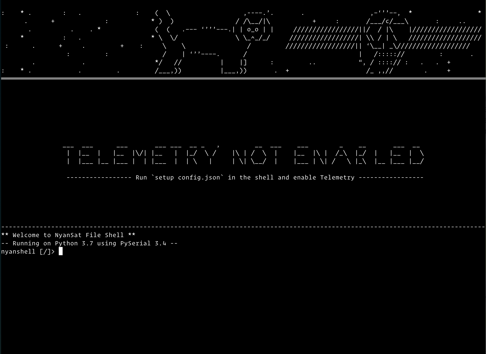
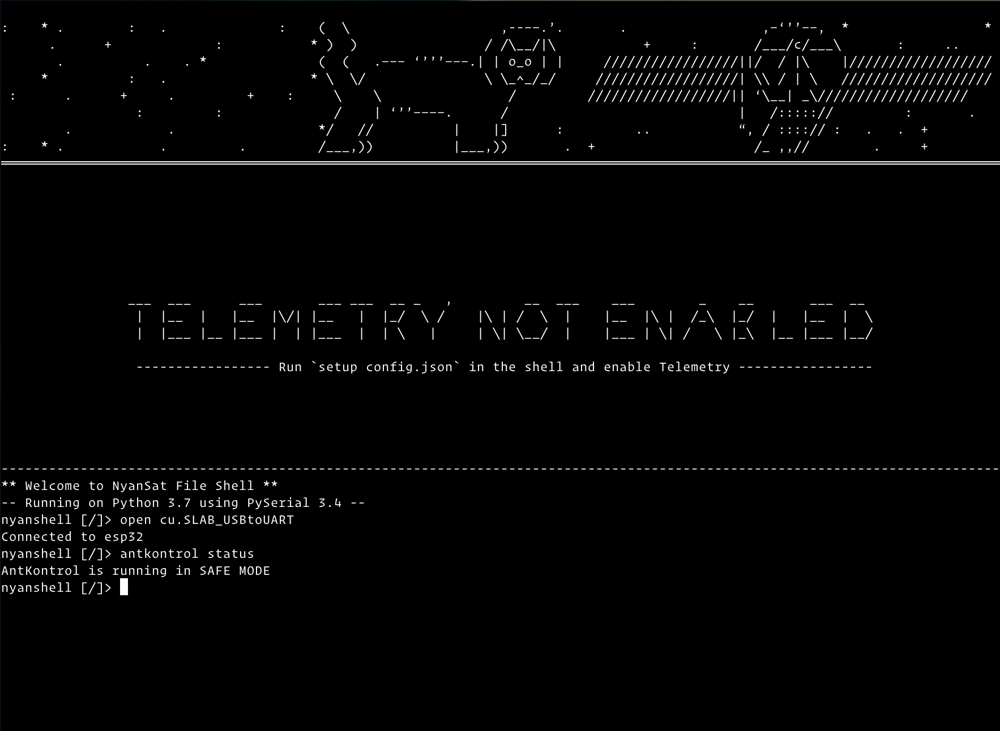

# NyanSat

Make your own base station to communicate with satellites!

## Setting Up

These set up procedures expect that your base station is fully assembled and your ESP32 is flashed with Micropython firmware. If not, check the [NyanSat website](https://nyan-sat.com) for detailed steps on how to assemble your hardware, plus some tips on avoiding common pitfalls. If you have an official Antenny board, you can also take a look at our [Getting Started Guide](https://github.com/RedBalloonShenanigans/antenny/blob/master/hardware/Antenny_board_hardware_setup_guide.pdf).

### Set up your host environment

NyanShell provides a convenient shell interface to communicate with your NyanSat base station. To install this interface, simply type `make nyanshell` in the project directory.

### Set up your base station environment

Once your host is set up, you can install NyanSat on your ESP32. Before anything, make sure you have a fully erased, freshly flashed micropython installation on your ESP32.

 First, determine which serial port corresponds to your ESP32. Then from the project directory, run `make nyansat SERIAL=<your ESP32 serial port>` to install it on your ESP32. During this process, you will be asked for your WiFi SSID and Password; this is to establish an internet connection for upip, which will install some dependencies. Towards the end of the install process, the script will ask you to setup webrepl on the ESP32.

## Usage

To enter NyanShell, type the following in a terminal window:

```
python3 -m nyansat.host
```

You should be greeted with a terminal window that looks like this:



The device is not connected automatically. You have several options to connect to the device; type the commands listed under your preferred connection option

### Connecting Via Serial

```
open <your ESP32's serial port>
```

**Note:** If you're on a UNIX or Linux based system, your serial port is likely at `/dev/tty.<port>`. You can leave out `/dev/` for this step.

### Connecting Via WebREPL

WebREPL is not enabled by default. To enable it, connect via serial port first and run the `setup` command to enable it. Afterwards, you can connect via WebREPL using the following command:

```
open ws:<your ESP32's IP address>,<your webrepl password>
```

### Clean Install

If you are developing on the board, you may end up in a situation where you would like to start from a clean slate. The steps to do so are simple:

1. Erase your ESP32 using `esptool.py`
2. Reflash the Micropython firmware using `esptool.py`
3. To get a fresh install of your shell, type `make nyanshell`
4. To install NyanSat software onto your ESP32, run `make nyansat SERIAL=<your serial port>`

### Exploring the Shell

Once you have connected to your ESP32, we still need to configure it to properly use NyanSat. However, this is a good opportunity to check out all of the available commands at your disposal! Type `help` to get the list.

To get more information about each documented command, you can type `help <command>` to get a brief description of the command including how to use it.

### Configuring AntKontrol

The heart of NyanSat is AntKontrol, a scalable API that you can extend to add more features on your NyanSat device. An AntKontrol instance is usually started up when the ESP32 boots up. However, if you wish to create a new instance, you can run `antkontrol start`. 

AntKontrol attempts to integrate different hardware into one interface. It is usually able to recover from misbehaving hardware and provide reduced functionality. However, if the motor implementation does not initialize properly, AntKontrol enters SAFE MODE. In this state, any commands issued will not move your base station's motors until you determine what the fault is. To determine if your device is in SAFE MODE, run `antkontrol status`. 



One of the main reasons why AntKontrol would enter SAFE MODE is an incorrect configuration. Depending on your setup, you may have a different pin layout, device addresses, or hardware than what NyanSat is expecting. Accordingly, you can use the `setup`, `i2ctest`, `pwmtest`, and `bnotest` commands to resolve the first two issues. For different hardware, the `repl` command provides you with a full Python interpreter, which you can use to implement your own exciting hardware. **Note:** If you wish to use the `repl` command, start nyanshell with the command `python3 -m nyansat.host.shell`; this command removes all decorative and telemetry elements, providing a focused environment for debugging.

By default, several features are disabled for the initial setup; this is to reduce debugging complexity. As you get familiar with the shell and hardware, you can choose to enable them using the `configs` and `set` commands to query and modify your configuration respectively.

### Moving Your Motors

After you are comfortable with your setup and everything appears to be initialized, you can start your base station by running the command `startmotion <azimuth> <elevation>`, where `<azimuth>` and `<elevation>` correspond to the initial position you would like your base station to be. **Note:** Please only run this command once after starting `antkontrol`. To tweak either the azimuth or elevation, type `azimuth/elevation <your desired value>` into the nyanshell commandline. A reasonable value would be any float from 10-90.

## Features

### Easy Pin Setup and Profile Management

If your pin configuration is different from the default values, you can easily change to them by running the `setup <profile_name>` command. This command creates a new profile with your given name and switches to it.

If you have multiple pin configurations on the ESP32, you can switch between them using the `switch <profile_name>` command. This command switches to your chosen profile, leaving the original one intact, but not in use.

### Telemetry

The NyanShell interface puts key metrics front and center from your base station. The interface displays the azimuth, elevation, and (if equipped with GPS module) your ground coordinates.

### IMU Calibration Guide (BNO055 specific)

Calibrating IMU's are difficult; the BNO055 is especially tough. NyanShell provides a calibration command to easily poll the calibration status of your BNO055. If the IMU is not calibrated, the command guides you through the process with on screen instructions and real time feedback on the calibration status. To start, simply type `calibrate` into the shell and follow the instructions until your IMU is calibrated.

If you have a predefined configuration with an IMU calibration profile, you can use the profile management commands to load the IMU calibration values.

### Motor Accuracy Measurement

While servo motors can take a position as input and try to reach it, the motor will not _exactly_ reach that position. Using the IMU, the `motortest` command cross references the position change of the motor with the measured change from the IMU. This allows you to see how accurately the motor assumes the desired position.

## Gotchas

As with any project, you may come across a few snags in the road— we certainly did! Here’s a few that we encountered and how we solved them. As a general rule, when you try to debug:
Use the command `python3 -m nyansat.host.shell` to interact with your device; this exposes *only* the shell to you
Reset the device by pressing the `BOOT`/`ENABLE` button on your ESP32, or pressing `Control + D` when using the `repl` interface

### After a NyanSat install, the device reports `no module named ‘logging’`

This usually occurs after a *reinstall* and appears to be an issue with upip, the MicroPython equivalent of PyPI. If you come across this issue,  enter the command `repl` in `nyanshell` and type the following commands:

```
>>> import upip
>>> upip.install(‘logging’)
```

This will install the `logging` module again. You can verify that it is installed by checking the `lib` directory on your base station.

### NyanSat stuck in SAFE MODE

SAFE MODE is a last resort for your NyanSat when it cannot properly initialize your motor driver. In this mode, it initializes a software mock motor system so you can at least play around with the interface. This is useful for debugging and developing features, but can be a pain when you’re trying to use the base station! Your NyanSat might be in SAFE MODE for several reasons:

1. **Your physical pin configuration may not match up with what NyanSat is using:** To verify this, run `configs` to list out the parameters your NyanSat is using. If you see a mismatch for your motor driver’s I2C pinout, you can change the configuration parameter using the `set` command. Take a look at the section for “Devices are not detected” for a more thorough discussion.
2. **Your motor driver’s I2C address may not match up with what NyanSat is using:** To verify this, run `configs` to list out the parameters your NyanSat is using. Then, use `i2ctest` or `pwmtest` to verify which address your motor driver is using; if you see multiple addresses, the first one is usually correct. If you see a mismatch, you can change the configuration parameter by using the `set` command.
3. **Your motor driver is not at PCA9685:** To verify this, run `pwmtest`. If `PWM connection established?` is `False`, but the other values are `True`, you *may* have a different motor driver. Fear not! `AntKontrol`’s API is designed to be extended, so you can create a new motor implementation for your unique motor driver! If you choose to do so, make sure to submit a Pull Request on the main [Antenny Project Repo](https://github.com/RedBalloonShenanigans/antenny)
4. **Your motor driver is broken!** To verify this, first make sure the cause isn’t any of the ones listed above. If `i2ctest` or `pwmtest` don’t return any address and you are sure your wiring is correct, you might have a defective motor driver :( Unfortunately, you need to replace your motor driver to move your base station.

### Devices are not detected

Assuming your devices are not defective, this could happen if your software or physical pin configurations are not correct. The first thing to do is verify the software pin configurations by running the `configs` command. If any pins are misconfigured in your software configuration, you can use the `set` command to fix it.

It is also possible that your physical pin configurations are not correct. Here are some possible pin misconfigurations:

- SDA & SCL are switched
- Logical GND pins are not all shared (connected to the same place)
- Logical Power supply is not outputting the minimum voltage (3.3-5V usually)
- Logical Power supply is shared with Motor Power supply (VERY bad practice)

Try to go through your physical configuration and ensure you’re using the best practices to connect everything:

- If you have exposed pads that directly contact metal, cover it with an insulator
- Make sure your soldering job actually makes a connection
- Ensure distinct power rails for logic and motors
- Be organized with your wiring
- Leave some slack in your wiring so there’s not significant stress on the connections
- Secure connections that can potentially come loose

### I2C Addresses seem to change

I2C devices use addresses to know how to communicate with each other. Some devices allow you to change the address physically by breaking out the pins responsible. If these pins are not connected to anything, it is possible that their voltage is undefined, or “floating”. This results in the device configuring itself with unexpected addresses from run to run. To ensure a stable I2C address, make sure each address pin has a defined voltage value. This is usually done by tying each pin to ground, but consult your device’s data sheet to properly handle this scenario.


## Requirements & Dependencies

General:
- Python >= 3.6

NyanShell:
- MPFShell
- TUI-DOM

NyanSat:
- Logging
- PCA9685 Adafruit Library
- BNO055 Adafruit Library, adapted for use in Micropython by Peter Hinch
- SSD1306
