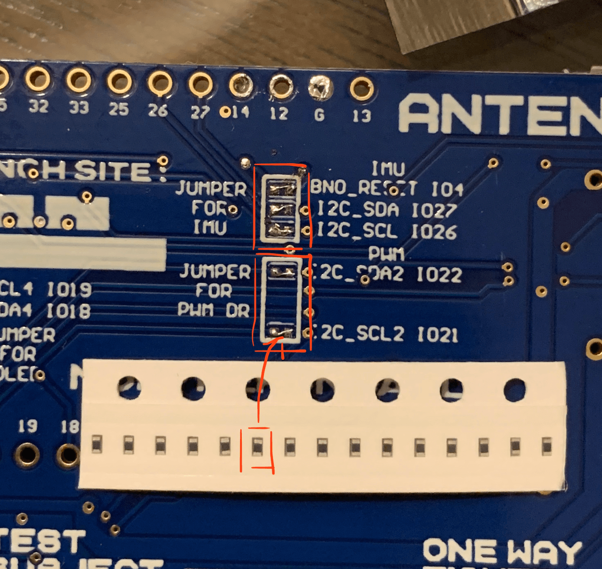

# Antenny

Make your own base station to communicate with satellites!

## First thing to do when you receive the kit

When you receive the Antenny Kit, first thing you need to do is to solder the jumper resistor on the Board. "Jumper for PWM Dr" is responsible to control the Servo gimbal. "Jumper for IMU is" for the MEMS Fusion sensor.



## Flash the Mircro-Python firmware on ESP32

Please refer to this [Getting started with MicroPython on the ESP32](https://docs.micropython.org/en/latest/esp32/tutorial/intro.html) guide for flahsing the firmware on Antenny KM7 board. You can choose the firmware with SPIRAM support.

- Important: When you start to program the Antenny board with esptool, please hold the K2 Tact Button until the program detect the download mode.

```
example command: python3 -m esptool --chip esp32 --port /dev/tty.SLAB_USBtoUART --baud 115200 write_flash -z 0x1000 ~/Downloads/esp32spiram-20210623-v1.16.bin
```


## Installing the Antenny package

If you are developing on the board, you may end up in a situation where you would like to start from a clean slate. The steps to do so are simple:

1. Erase your ESP32 using `esptool.py`
2. Reflash the Micropython firmware using `esptool.py` (as above)

(Steps 1 and 2 should not need to happen except in drastic cases.)

3. To install Antenny software onto your ESP32, run `make nyansat SERIAL=<your serial port>`
4. Once this has completed, reboot the device with the terminal open to verify installation completed correctly.

Note: Any import errors will only be seen at boot. You cannot re-import the 
API class outside of the boot sequence. You should see the following at boot.

## Getting Started

To enter device shell, type the following in a terminal window:

```
screen <block device> 115200
```

or

```
minicom -D <block device> -b 115200
``` 

Your block device will be the newest /dev/* device created once connected to your computer.

You should be greeted with an open Python3 interpreter.

### Connecting Via WebREPL

WebREPL is not enabled by default. To enable it, connect via serial port first and run the `setup` command to enable it. Afterwards, you can connect via WebREPL using the following command:

```
open ws:<your ESP32's IP address>,<your webrepl password>
```

### Configuring Antenny

Your hardware is described by a series of .json files. These files are exposed
via classes implemented in `nyansat/station/config/config.py`

##### api.antenny_config
- `configs/antenny/default.json` describes the general base station integration with pin connections as well as high-level attributes like current longitude and latitude.
- Help information for each antenny_config member can be retrieved via `api.antenny_config_help()`

##### api.imu_config
- `configs/imu/default.json` describes the calibration profile of an IMU (if available). Can be used when switching between IMUs and switching between different profiles.

##### api.servo_config
- `configs/servo/default.json` describes the limits of the servo motors. Can be used to change gimbals or to finely tune the current limits.

To get or set these values from the interpreter simply `<class instance>.get/.set`

Also available are `.save()` and `.load()`.

To use the config on boot, run `.save_as_default()`.

### Initializing the Antenny system
After setting up your `antenny_config` to match your hardware, you have to initialize the api to use the drivers.

Run `api.antenny_initialize_components()` to adjust your antenny to the current config state. This will error if your
 antenny can not detect the proper hardware. 

### Moving Your Motors

If `api.antenny_config.get('use_motor')` is `True` your PWM driver is initialized.

You may move your servo gimbal with a command like:

`api.elevation_servo.set_position(<duty cycle>)`

Duty cycle to angle mapping is hardware-dependent and must be calibrated. See Calibration.

### Checking your IMU
If `api.antenny_config.get('use_bno08x')` is `True` you now have access to your bno08x, and likewise for the `use_bno055`

To check your IMU reports you can run `api.imu.get_euler()` to see reported yaw, roll and pitch angles (in that order)

In the case of the `bno08x`, we must calculate the euler values ourselves, to see the raw quaternion values, you can 
access the underlying `bno08x` driver and run `api.imu.bno.geomagnetic_quaternion` which prints x, y, z, w values (in
 that order).
 
### Calibrating your IMU
The Antenny gives you the option to manually calibrate the IMU (This is difficult and not suggested).

To do so, run `api.imu.calibrate_<accelerometer, gyroscope, magnetometer>` and follow the instructions printed. Other
 calibration options are listed below. 
 
### Calibrating the assembled platform
The preferred way to calibrate the system is to use the servo motors to assist in calibration motions. Additionally, 
this step will auto calibrate the servo limits using the IMU motion. 

To do this run `api.antenny_calibrate(name=<name_of_calibration_config>(optional))`. This command will perform the 
auto-calibration routine and then use this on startup. If you wish to save multiple, or switch between, you may 
provide a name and switch as described in the config section above.

## Preparing and using the Antenny
### Orientation
Once your device is setup and calibrated, you have to orient the system. This is only required for servo motors, as 
they are 
unable to rotate 360 degrees. This will find the geomagnetic limits of the system and prevent you from setting the 
desired position in that range. 

To set the orientation, place the platform in the space it will remain (you must repeat this process if you move it) 
and run `api.platform_orient()`.

### Starting the platform
After orienting the device, you may start the antenna motion by running `api.platform_start()`. This will start the 
internal PID loop. This will keep the device pointed at its current geomagnetic orientation if you move the platform 
(Not recommended due to orientation issues described above. )

### Setting a new antenna position
To set the antenan to a specific geomagnetic orientation, you must set the azimuth and elevation. You may do this as 
follows:
`api.platform_set_azimuth(degrees)`
`api.platform_set_elevation(degrees`

### Stopping the platform
You may stop the automatic movement of the platform by running `api.platform_stop()`

### Satellite TLE Tracking
Coming soon...

## The Antenny Host System
Under Development...

Cooperation between the antenny board and another system is possible through the antenny client as well as the UDP 
Sender. Use of the client is not suggested while developing on or debugging the system, but could be useful for more 
interesting applications such as beacon tracking. 

### The Command Invoker
The `command_invoker` is a 1:1 library to the antenny `api` class found at `nyansat/host/shell/command_invoker.py`. The 
`command_invoker` calls out to the board through MPFShell to exec API commands. Feedback and error handling does not 
work very well so work should be offloaded to the board when possible. 

### Antenny Client
The `antenny_client`, found at `nyansat/host/shell/antenny_client.py` should use the command invoker to implement 
higher level functions in conjunction with more computationally expensive libraries. 

### Shell
Current depricated. 

The antenny client can then be integrated into the MPFShell environment through `nyansat/host/shell/__main__.py`. 
Commands of the format `do_<cmd>()` will be used as shell commands. See the file for examples. This shell can then be
 run through the command `make nyanshell`.

## Known Issues
- The BNO08x calibration never finishes :(
- The BNO08x euler angles are incorrect (maybe calibration, maybe I'm bad at math, probably both.)


##Requirements

- Python >= 3.6

NyanShell:

- MPFShell
- TUI-DOM
