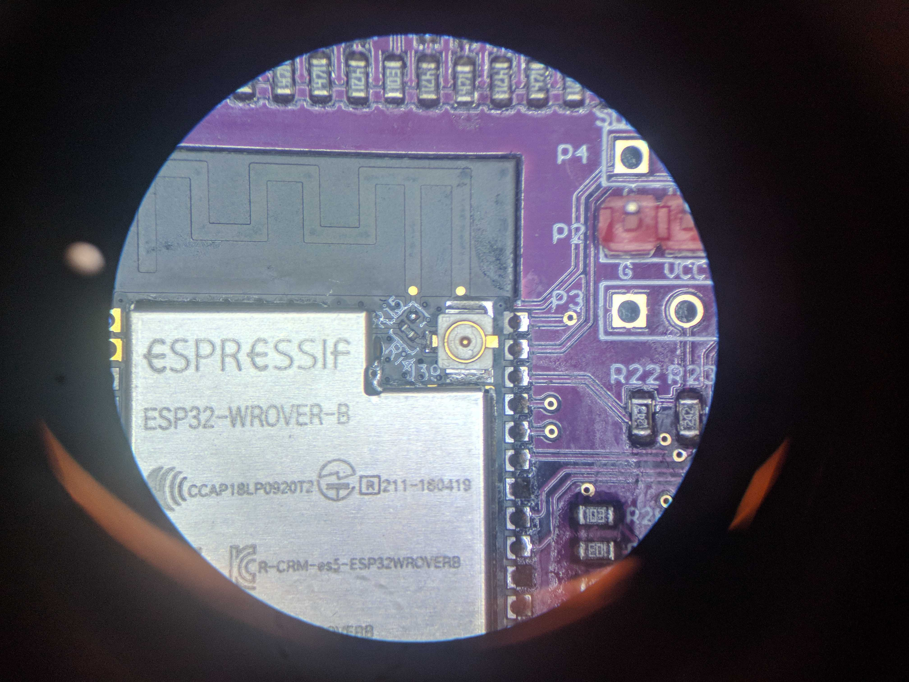

# Antenny

Make your own base station to communicate with satellites!

We have a [discord server](https://discord.com/invite/nsSMEdv) for collaboration, questions, and show and tell off!

## Setting up the hardware

### Important Notice:
- Pin conflict: Do NOT use the folloing pins for GPIO if you are using SPIRAM firmware:
```
# known_confilit_pins = [
#     0, 1, 3, 6, 7, 
#     8, 9, 10, 11, 12, 
#     13, 16, 17, 20, 24, 
#     28, 29, 30, 31
# ]
```
- Pin that is input only
```
# input_only_pins = [34, 35, 36, 37, 38, 39]
```

### Jumpers

#### Required Antenny Jumpers
- On the antenny MK7 there are two required jumpers, labeled `JUMPER FOR PWN DR` on the back of the board. This will 
bridge the GPIO to the on board PWM Driver. 

#### Optional Antenny Jumpers

- The antenny MK7 provides jumpers to breakout pins 4, 26, 27, VCC and GND to the header labeled `P11` for the IMU. 
To use this header, you must solder the jumpers labeled `JUMPER FOR IMU`, otherwise, just used the ESP32 GPIO headers.

- To use wifi, either provide a antenna to the ESP32s on board jack, or solder the jumper next to the antenna 
connector labeled `R15` on the ESP32. See below picture. 




- Important: When you start to program the Antenny board with esptool, please hold the K2 Tact Button until the program detect the download mode.


#### Optional IMU Jumper
There is one optional IMU jumper. This is used to select the IMU mode. More info can be found in the [BNO080 
datasheet](https://cdn.sparkfun.com/assets/1/3/4/5/9/BNO080_Datasheet_v1.3.pdf)
If you do not want to use the jumper, you can use pins to select the correct mode. This can also be useful for 
switching between modes in software. 

The mode we use is the Robotic Vacuum Cleaner (RVC) mode. To enable this you can provide power to the PS0 pin using 
the jumper as shown below. 


### Setting up the platform
This will go over how to setup the servo gimbal, IMU and antenny board. I used hot glue to secure the hardware, but 
more creative approaches are welcome. 

####Step 1: Position the IMU
Position the IMU on the gimbal arm. The position show below will give the correct orientation. If you want a 
different IMU position, you can correct the elevation angle in software. 


#### Step 2: Position the Antenny
Next we secure the Antenny to the platform. It is advised to isolate the pins from any metal contact.


### Step 3: Wire the IMU Communication Lines
NOTE: From this point on, the pins you use are configurable from the `antenny_config`, as described in the software 
guide below. To verify your pins or reconfigure as you wish, it is suggested you edit the config through the 
`antenny_manual_setup` command described in the software guide. 

The IMU communication lines are labeled on both the IMU PCB and the Antenny PCB, just match them up, as shown. 


### Step 4: Wire the IMU Reset Line
Same as step 3, it is labeled.


### Step 5: Wiring the Program Select Pins (Optional):
If you did not solder the IMU jumper, you must pick two pins to use to control PS0 and PS1. If using this approach, 
its suggested you setup these pins using the `antenny_manual_setup`. 


### Step 6: Wiring the Servos
Next we wire the servos to the PWM controller. By default the elevation(top) servo goes to pwm index 0 and azimuth
(bottom) goes to index 1, but this is, again, configurable. 


# Installing the Antenny software

## Installing Micropython
1. Download and install the USB driver for the CP210 USB to UART chip [here](https://www.silabs.com/developers/usb-to-uart-bridge-vcp-drivers)

2. Download esptool from [here](https://github.com/espressif/esptool/)

3. Put the ESP into download mode (see above) and erase your ESP32

    Example: ```python3 -m esptool --port /dev/tty.SLAB_USBtoUART erase_flash```
    
4. Download the micropython firmware from [here](https://micropython.org/resources/firmware/esp32spiram-20210623-v1.16.bin)

5. Put the ESP into download mode (see above) and re-flash the Micropython firmware

    Example: ```python3 -m esptool --chip esp32 --port /dev/tty.SLAB_USBtoUART --baud 115200 
write_flash -z 0x1000 ~/Downloads/esp32spiram-20210623-v1.16.bin```

## Installing Antenny MP Code
0. We use MPFShell to upload the python files to the board. First you must install this on your host computer with 
`python3 -m pip install mpfshell`.
1. To begin install, first push the reset button on the antenny board, labeled `RET Button`.
2. Next, from the root directory of this repository, run  the `make nyansat` make directive with the `SERIAL` 
argument pointing to your antenny block device.

    Example: `make nyansat SERIAL=/dev/tty.SLAB_USBtoUART`
3. The Installer will give you a series of prompts.
    - `Do you want to do an installation of all components and libraries?(Y/n)`
    
        - If this is your first install, or you would like to do a fresh install of all code select `Y`, otherwise, 
        if you would only like to install specific components select `N`.
        
    - If you selected `Y` for the previous prompt you will see:
    
        - `Are you sure you want to erase all files on the device? (y/N)`
    
            - This is just a confirmation, as a full install will take a bit of time.
        
    - If you selected `N` you will see:
    
        - `Name a component you wish to install:`
        
            - If you are developing new components or making fixes to existing ones, you can upload one component at 
            a time by typing its name into this prompt. That name should correspond to a sub directory found in the 
            [station](https://github.com/RedBalloonShenanigans/antenny/tree/master/nyansat/station) directory. For 
            example selecting `imu` would upload all code in the [imu](https://github.com/RedBalloonShenanigans/antenny/tree/master/nyansat/station/imu) sub directory.
            
        - `Do you wish to install more? (y/N)`
        
            - Use this to repeat the above step.
            
        - `Do you want to keep the configs on the device? (Y/n)`. 
        
            - If you would like to restart your antenny configs from the repository state, select `N`, to keep your 
            configs on board select `Y`. 
            
        - `Do you want to re-install the libraries (y/N)`
        
            - Select yes to reinstall the libraries found [here](https://github.com/RedBalloonShenanigans/antenny/tree/master/lib)
            
4. You should see the installer upload the code to the antenny. 

5. You will see the installer report `False` upon completion, press `Enter` to continue.

6. The installer will prompt you for your WiFi info. If the above steps were taken to enable WiFi, enter your info, 
otherwise leave blank.

Your installation is complete!     

# Getting Started

## Entering the Python interpreter

1. Using a terminal utility of your choice, enter the devices python interpreter.

    - Examples:

        `screen <block device> 115200`
        
        or
        
        `minicom -D <block device> -b 115200`
        
    - In the case of windows, Putty is suggested.

2. Upon entering the interpreter you should be met with the python prompt `>>>`. If you are not try the reset button 
on the side of the board or revisit the `Installing Micropython` section of this README.

3. To view any potential import errors, press the reset button on the board as described in the installation section. 

     - In micropython, the first script run on startup will always be `boot.py` followed by `main.py`. 
     The `main.py` script will import all relevant antenny code and provide access to `api`, an instance of 
[AntennyAPI](https://github.com/RedBalloonShenanigans/antenny/blob/master/nyansat/station/api/api.py). 

## Using the Antenny API

### Device Startup

Once your hardware is properly setup and you have installed the antenny station code, you can begin working with the 
device. To interface with the device from the python interpreter, we will use member methods of the `api` class. 

#### High Level Methods

High level methods start with `antenny_` are used to setup your antenny assembly, calibrate and save calibration data. 

- `api.antenny_init_components()`

    - Initializes the components described by the current config. For more info on device configuration, please see 
    the "Configuring Antenny" section. 
    
- `api.antenny_calibrate()`

    - Calibrates the antenny platform. 
    - NOTE: This will start the automatic calibration routine. Currently, IMU calibration only supported by the BNO055 
    IMU. BNO080 support expected soon.
    
- `api.antenny_save(name: Optional)`

    - Saves the current configuration of each component as default. With an optional name. Makes the state of the 
    configuration and calibration persistent. 
    
- `api.antenny_manual_setup()`

    - This will walk you through manual configuration of the antenny board and its components. Useful if it is your 
    first time setting up, or for easier access to some of the more useful config entries.

#### Platform Methods

Platform methods start with `platform_` and are used to operate the platform, a term used in this project to describe 
the pwm driver, the motors it is driving, the IMU and the antenny board as a single assembly. 

- `api.platform_orient()`
 
    - Orients the platform to its current position. Should be run after repositioning the gimbal platform. This finds
     the 90 degree dead zone of the azimuth servo.
     
- `api.platform_start()`

    - Enables movement of the platform. Commands can be issued to point at specific coordinates.
    
- `api.platform_stop()`

    - Disables movement of the platform. Commands can be issues to manually move the servods or re-orient the platform.
    
- `api.platform_set_azimuth(az: int)`

    - Sets the azimuth coordinate of the platform while movement is enabled. 
    
- `api.platform_set_elevation(el: int)`

    - Sets the azimuth coordinate of the platform while movement is enabled. 

- `api.platform_set_coordinates(az: int, el: int)`

    - Sets both coordinates of the platform while movement is enabled.
    
#### Servo Methods

Each individual servo can be operated manually through these methods. Without access to the IMU the servos will not 
know they're orientation.

- `api.elevation_servo_set_position`
- `api.azimuth_servo_set_position`

    - Sets the position of the elevation servo. The current specs for the servos provided with the antenny put the 
    position argument in range(0, 4096), however only a subset of that range will actually move the servo.
    
- `api.elevation_servo_set_min_max(min: int, max: int)`
- `api.azimuth_servo_set_min_max(min: int, max: int)`

    - Sets the minimum and maximum `position` arguments that allow the servo to move, part of the higher level 
    calibration step. 

#### IMU Methods

IMU data can be accessed directly from the API as well. 

- `api.imu_get_azimuth()`

    - Returns the azimuth in degrees as reported by the IMU
    
- `api.imu_get_elevation()`

    - Returns the elevation in degrees as reported by the IMU
    
- `api.imu_get_euler()`

    - Returns the euler angles in order of yaw, roll, pitch. 
    
The IMU can also be manually calibrated

- `api.imu_calibrate()`

    - Begins the calibration routine. For best results, follow the printed instructions from the console. 
    
#### Other

There are plenty of other methods, most used for debugging, available to the user, as well as direct access to 
underlying components. For more information, reading through the antenny code is advised.      


### Configuring Antenny
NOTE: These configs have wrappers to properly alter the config members before saving in the API. In general only the 
High Level `api.antenny_save(name: Optional)` should be used by users. 

Your hardware is described by a series of 
[configs](https://github.com/RedBalloonShenanigans/antenny/tree/master/nyansat/station/configs) that can be updated 
through your installer or on the antenny board itself. This section will go over on baord config modification. To use 
the installer re-visit the above guide.

The api uses the 
[Config](https://github.com/RedBalloonShenanigans/antenny/blob/master/nyansat/station/config/config.py) class to 
manage configs and are exposed by the `AntennyAPI`. There are currently three configs used by the antenny system, but
 any components that require information to be stored across boots should use its own config.
 
#### Antenny API Config classes
    
- `api.antenny_config`
    - The [antenny_config](https://github.com/RedBalloonShenanigans/antenny/tree/master/nyansat/station/configs/antenny) 
describes the base station integration with pin connections as well as high-level attributes like current longitude and latitude.
    - Help information for each antenny_config member can be retrieved via `api.antenny_config_help()`

- `api.imu_config`
    - The [imu_config](https://github.com/RedBalloonShenanigans/antenny/tree/master/nyansat/station/configs/imu) 
    describes calibration data of the IMU. Currently only available for the BNO055, for more details on this you can 
    view the BNO055 and BNO08x data sheets.

- `api.servo_config`
    - The [servo_config](https://github.com/RedBalloonShenanigans/antenny/tree/master/nyansat/station/configs/servo) 
    describes the limits of the servo motors.

#### Config Methods

- `Config.set(<member>, <value>)`: Sets a config to a new value.

- `Config.get(<member>)`: Gets the current value of a config member.

- `Config.save(name: Optional)`: Saves the current config to the device, with a new name option for multiple configs.

- `Config.load(name: Optional)`: Loads the currently saved values, if name is specified, loads from a previously 
saved config, if it is not, reloads the last save of the current config.

- `Config.save_as_default_config()`: The current config will be loaded on reboot. 

- `Config.load_default_config()`: Load the config that was present on reboot.


## The Antenny Host System
Under Development...

Cooperation between the antenny board and another system is possible through the antenny client as well as the UDP 
Sender. Use of the client is not suggested while developing on or debugging the system, but could be useful for more 
interesting applications such as beacon tracking. 

### The Command Invoker
The `command_invoker` is a 1:1 library to the antenny `api` class found at `nyansat/host/shell/command_invoker.py`. The 
`command_invoker` calls out to the board through MPFShell to exec API commands. Feedback and error handling does not 
work very well so work should be offloaded to the board when possible. 

### Antenny Client
The `antenny_client`, found at `nyansat/host/shell/antenny_client.py` should use the command invoker to implement 
higher level functions in conjunction with more computationally expensive libraries. 

### Shell
Current depricated. 

The antenny client can then be integrated into the MPFShell environment through `nyansat/host/shell/__main__.py`. 
Commands of the format `do_<cmd>()` will be used as shell commands. See the file for examples. This shell can then be
 run through the command `make nyanshell`.

## Known Issues
- The BNO08x calibration never finishes :(
- The BNO08x euler angles are incorrect (maybe calibration, maybe I'm bad at math, probably both.)


##Requirements

- Python >= 3.6

NyanShell:

- MPFShell
- TUI-DOM
