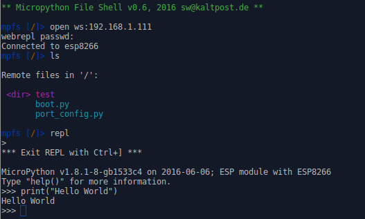

# mpfshell

2016-06-21, sw@kaltpost.de

A simple shell based file explorer for ESP8266 and WiPy
[Micropython](https://github.com/micropython/micropython) based devices.

The shell is a helper for up/downloading files to the ESP8266 (over serial line and Websockets)
and WiPy (serial line and telnet). It basically offers commands to list and upload/download
files on the flash FS of the device.

Main features:

* Support for serial connections (ESP8266 and WiPy)
* Support for websockets (via WebREPL) connections (ESP8266 only)
* Support for telnet connections (WiPy only)
* Full directory handling (enter, create, remove)
* Transfer (upload/download) of multiple files matching a reg.-exp.
* All files are transferred in binary mode, and thus it should be
  possible to also upload pre-compiled code (.mpy) too.
* You can compile and upload files with one command.
* Integrated REPL (supporting a workflow like: upload changed files, enter REPL, test, exit REPL, upload ...)
* Fully scriptable
* Tab-completion
* Command history
* Best of all: it comes with color

__Note__: The software is mainly tested on Ubuntu 16.04 LTS. However, there is basic Windows support
(tested with Python 3.5 and PySerial 3.1), but some of the keys (e.g. Tab) are note working as
expected yet.

## Requirements

General:

* ESP8266 or WiPy board running latest [Micropython](https://github.com/micropython/micropython)
* For the ESP8266 firmware build from the repository, please note, that WebREPL is not started
  by default. For more information see the [quickstart](http://micropython.org/resources/docs/en/latest/esp8266/esp8266/quickref.html#webrepl-web-browser-interactive-prompt).
* For the WiPy, please note, that you need to enable REPL on UART if you intend to connect
  via serial line to the WiPy (see [here](http://micropython.org/resources/docs/en/latest/wipy/wipy/tutorial/repl.html))

For the shell:

* Python >= 2.7 or Python >= 3.4
* The PySerial, colorama, and websocket-client packages (`pip install -r requirements.txt`)

__IMPORTANT__: It is highly recommended to use PySerial version 3.x on Python 2 and 3.

__Note__: The tools only work if the REPL is accessible on the device!

## Installing

### From PyPi

To install the latest release from PyPi:

    sudo pip install mpfshell

### From Source

Clone this repository:

    git clone https://github.com/wendlers/mpfshell

To install for __Python 2__, execute the following:

    sudo pip install -r requirements.txt
    sudo python setup.py install

To install for __Python 3__, execute the following:

	sudo pip3 install -r requirements.txt
    sudo python3 setup.py install

## Known Issues

* For PySerial 2.6 the REPL is deactivated since Miniterm (which comes with 2.6)
    seems broken.

## General

### TAB Completion

The shell supports TAB completion for commands and file names.
So it's totally worth pressing TAB-TAB every now and then :-)

### File/Directory Names

File names including whitespaces are supported, but such names need to be enclosed
in quotes. E.g. accessing a file named "with white space.txt" needs to quoted:

    get "with white space.txt"
    put "with white space.txt" without-white-space.txt
    put without-white-space.txt "with white space.txt"

The following characters are accepted for file and directory names:

    A-Za-z0-9 _%#~@/\$!\*\.\+\-

## Shell Usage

__Note:__ Since version 0.7.1, the shell offers caching for file and
directory names. It is now enabled by default. To disable caching,
add the `--nocache` flag on the command line.

Start the shell with:

    mpfshell

At the shell prompt, first connect to the device. E.g. to connect
via serial line:

    mpfs> open ttyUSB0

Or connect via websocket (ESP8266 only) with the password "python":

    mpfs> open ws:192.168.1.1,python

Or connect vial telnet (WiPy only) with username "micro" and password "python":

    mpfs> open tn:192.168.1.1,micro,python

__Note__: Login and password are optional. If left out, they will be asked for.

Now you can list the files on the device with:

    mpfs> ls

To upload e.g. the local file "boot.py" to the device use:

    mpfs> put boot.py

If you like to use a different filename on the device, you could use this:

    mpfs> put boot.py main.py

To compile before uploading and upload the compiled file (you need mpy-cross in your path):

    mpfs > putc boot.py

Or to upload all files that match a regular expression from the
current local directory to the current remote directory:

    mpfs> mput .*\.py

And to download e.g. the file "boot.py" from the device use:

    mpfs> get boot.py

Using a different local file name:

    mpfs> get boot.py my_boot.py

Or to download all files that match a regular expression from the
current remote directory to the current local directory:

    mpfs> mget .*\.py

To remove a file (or directory) on the device use:

    mpfs> rm boot.py

Or remove all remote files that match a regular expression:

    mpfs> mrm test.*\.py

To create a new remote directory:

    mpfs> md test

To navigate remote directories:

    mpfs> cd test
    mpfs> cd ..
    mpfs> cd /some/full/path

See which is the current remote directory:

    mpfs> pwd

Remove a remote directory:

    mpfs> rm test

__Note__: The directory to delete needs to be empty!

To navigate on the local filesystem, use:

    lls, lcd lpwd

Enter REPL:

    repl

To exit REPL and return to the file shell use Ctrl+]

For a full list of commands use:

    mpfs> help
    mpfs> help <command>

The shell is also scriptable.

E.g. to execute a command, and then enter the shell:

    mpfshell -c "open ttyUSB0"

Or to copy the file "boot.py" to the device, and don't enter the shell at all:

    mpfshell -n -c "open ttyUSB0; put boot.py"

It is also possible to put a bunch of shell commands in a file, and then execute
them from that file.

E.g. creating a file called "myscript.mpf":

    open ttyUSB0
    put boot.py
    put main.py
    ls

And execute it with:

    mpfshell -s myscript.mpf

## Running the Shell in a Virtual Environment

Somtimes the easiest way to satisfy the requirements is to setup a virtual environment. 
E.g. on Debian Jessie (which still has PySerial 2.6), this could be
done like so (assuming you are within the `mpfshell` base directory):

Install support for virtual environments:

    sudo apt-get install python3-venv

Create a new virtual environment:

    pyvenv venv

Or you could use `python3 -m virtualenv venv` instead of `pyvenv`.

Activate it (so every following `pip install` goes to the new virtual environment):

    source venv/bin/activate

Now install the dependencies to the virtual environment:

    pip install -r requirements.txt
    python setup.py install

Now run the shell with the following command:

    python -m mp.mpfshell

__Note:__ The environment always has to be activated with the above command before using it.
